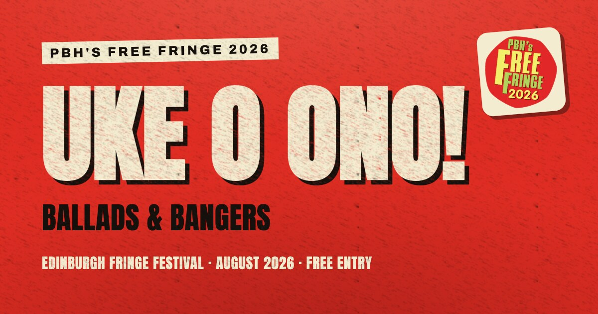

# uke-o-ono.com

[](https://github.com/laazyj/composureCDK)
[](LICENSE)
[](LICENSE-content.md)

[](https://uke-o-ono.com)

Monorepo for **uke-o-ono.com** — a single-page online flyer for Uke O Ono, an
Edinburgh ukulele band playing PBH's Free Fringe 2026 ("Ballads & Bangers").

Built the same way as [ukehoot.net](https://ukehoot.net): an Nx monorepo with an
Eleventy static site and a [composureCDK](https://github.com/laazyj/composureCDK)
AWS deployment (S3 + CloudFront + ACM). DNS is hosted at Cloudflare — see the
[CDK README](packages/cdk/README.md#dns--certificate).

## Packages

| Package           | What it is                                      |
| ----------------- | ----------------------------------------------- |
| `@uke-o-ono/site` | Eleventy static site (the flyer).               |
| `@uke-o-ono/cdk`  | composureCDK app — S3/CloudFront/ACM + CI OIDC. |

## Common commands

```sh
npm install          # install workspace deps
npm run site:start   # serve the site locally (Eleventy --serve)
npm run verify       # format:check + build + lint + test (the CI gate)
npm run cdk:diff     # diff infrastructure against AWS
npm run cdk:deploy   # deploy (CI does this on push to main)
```

## Configuration

- **Domain** is centralised in `packages/cdk/src/app.ts` (`CONFIG.domain`).
- **Google Analytics** is opt-in: set `GA_MEASUREMENT_ID` at build time to emit
  the GA4 tag and the cookie-consent banner. Unset = no analytics, no banner.

## Pre-commit secret scan

A Husky `pre-commit` hook runs [gitleaks](https://github.com/gitleaks/gitleaks)
against staged changes. Install it with `brew install gitleaks`, or skip a
single commit with `git commit --no-verify`.

## Contributions

This is a personal project for one band and is not accepting contributions.
You're welcome to read the code and reuse the parts the licence permits.

## Licence

The source code is MIT licensed (see [`LICENSE`](LICENSE)). The site copy, gig
data, photographs, and branding are not licensed for reuse (see
[`LICENSE-content.md`](LICENSE-content.md)).

Found a security issue? See [`SECURITY.md`](SECURITY.md).
